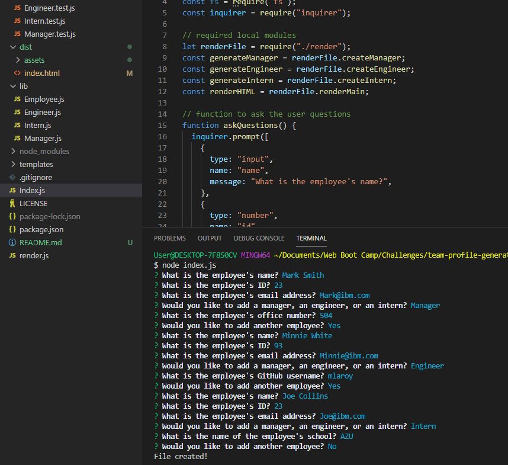
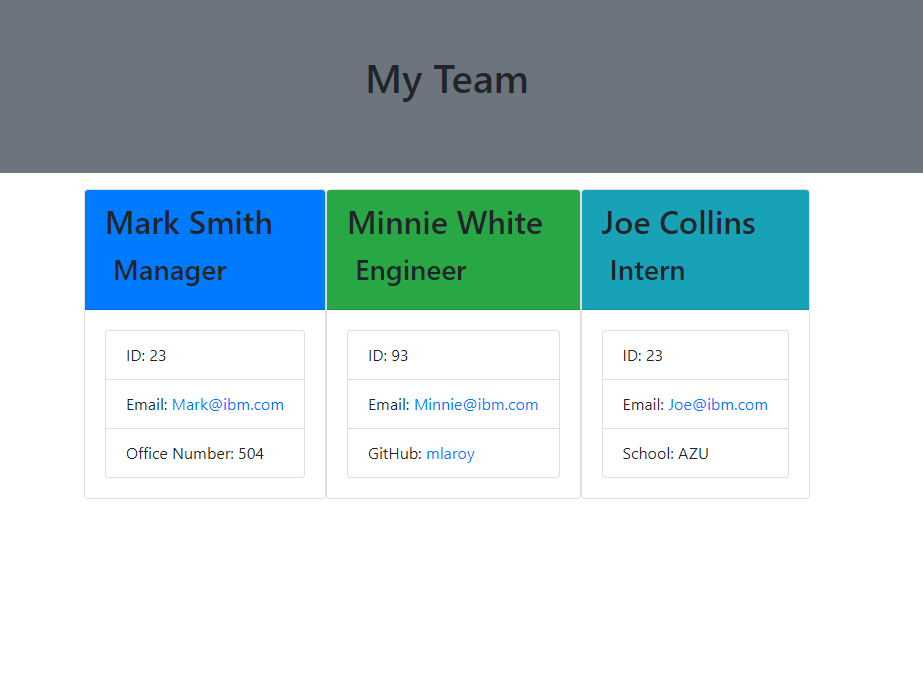

# Team Profile Generator

# Table of Contents:
- [Team Profile Generator](#team-profile-generator)
- [Table of Contents:](#table-of-contents)
  - [Description:](#description)
  - [Installation Instructions:](#installation-instructions)
  - [Usage Information:](#usage-information)
  - [License:](#license)
  - [Contribution Guidelines:](#contribution-guidelines)
  - [Tests:](#tests)
  - [Credits:](#credits)
  - [Questions?](#questions)

## Description: 

This is a Node.js command-line application that receives information about employees on a software engineering team and generates a roster with summary cards for each team member.

## Installation Instructions:

You will need to install Node.js, npm, and inquirer before running this application. 

## Usage Information:

Start first by cloning the repository at https://github.com/amiedawn/team-profile-generator . Then install the Node.js and the other necessary npm packages. Finally run the application in the terminal by typing “node index.js” and answer the questions.  The user of this application will be the team manager. Upon starting the application, he or she is prompted with several questions to load the data that will appear in the roster. The three types of employees that can be chosen are manager, engineer, and intern. Each card shows the name, position, ID number, and email address. Beyond that, each employee type has its own distinct card: a manager has a blue heading and lists his or her office number, an engineer has a green heading and lists the employee's GitHub username, and an intern shows the school in which he or she is enrolled. If you click on any of the email addresses, you will be directed to an email editor and the "To:" box should be pre-filled. If you click on the GitHub username for an engineer, a new tab should open on your browser and you will be directed to the engineer's GitHub page.  This screenshot shows the questions that a user will be asked:   .  This screenshot shows what the HTML page will look like with these answers:  .

## License:

This site is under this license: MIT

For details on this license, please follow: https://opensource.org/licenses/MIT

## Contribution Guidelines:

If you would like to contribute to this project, please contact the author via GitHub.

## Tests:

Unit tests were designed for each employee type: Employee, Manager, Engineer, and Intern. You may run these tests by installing Jest and running the command "npm run test".

## Credits:

Thank you to several GitHub users for their examples which helped in the design of this application: AlexTagg392, cml2377, and annasuvvac. Also, thank you to my instructor Jason Whitted for providing several helpful videos to assist in this project.

## Questions?

Please feel free to contact the author of this project at the following:

GitHub: <https://github.com/amiedawn>
